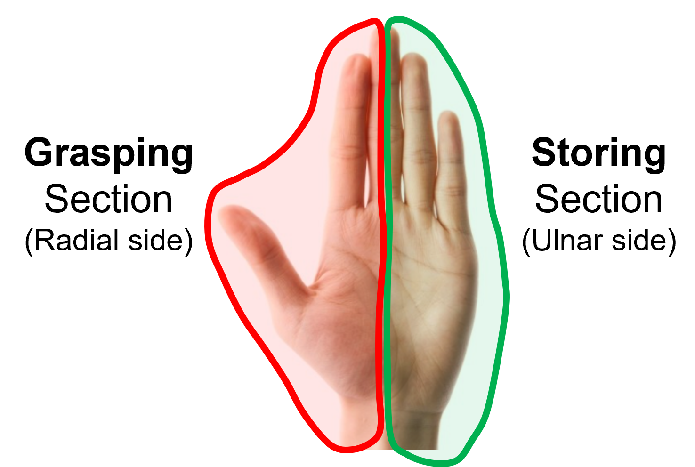
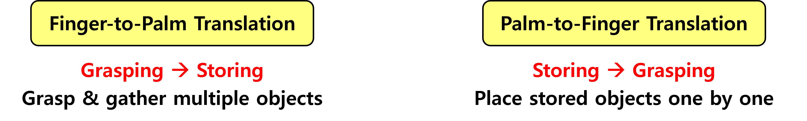

<!-- Using HTML to center the abstract -->
<div class="columns is-centered has-text-centered">
    <div class="column is-four-fifths">
        <h2>Abstract</h2>
        <div class="content has-text-justified">
Humans use their dexterous fingers and adaptable palm in various multi-object 
grasping strategies to efficiently move multiple objects together in various situations. 
Advanced manipulation skills, such as finger-to-palm translation and palm-to-finger 
translation, enhance the dexterity in multiobject grasping. These translational movements 
allow the fingers to transfer the grasped objects to the palm for storage, enabling the 
fingers to freely perform various pick-and-place tasks while the palm stores multiple 
objects. However, conventional grippers, although able to handle multiple objects 
simultaneously, lack this integrated functionality, which combines the palm’s 
storage with the fingers’ precise placement. Here, we introduce a gripper for 
multi-object grasping that applies translational movements of fingertips 
to leverage the synergistic use of fingers and the palm for enhanced 
pick-and-place functionality. The proposed gripper consists of four fingers 
and an adaptive conveyor palm. The fingers sequentially grasp and transfer objects 
to the palm, where the objects are stored simultaneously, allowing the gripper to move 
multiple objects at once. Furthermore, by reversing this process, the fingers retrieve 
the stored objects and place them one by one in the desired position and orientation. 
A finger design for simple object translating and a palm design for simultaneous object 
storing were proposed and validated. In addition, the time efficiency and pick-and-place 
capabilities of the developed gripper were demonstrated. Our work shows the potential of 
finger translation to enhance functionality and broaden the applicability of multi-object 
grasping.
        </div>
    </div>
</div>

---

<div class="columns is-centered has-text-centered">
    <div class="column is-four-fifths">
        <h2>Video</h2>
        <div class="content has-text-justified">
This video explains the research motivation, the mechanism design of the proposed gripper, and its applications.
        </div>
    </div>
</div>

<div align="center">
    <iframe width="720" height="405" 
            src="https://www.youtube.com/embed/qFD562zo4Vk?autoplay=1&mute=1&loop=1&playlist=qFD562zo4Vk&controls=1&fs=1" 
            frameborder="0" allowfullscreen>
    </iframe>
</div>

---

<div class="columns">
    <!-- Left Column: YouTube 비디오 (Visual Effects) -->
    <div class="column">
        <h3 class="title">Demo - Logistics</h3>
        <iframe width="100%" height="315"
                src="https://www.youtube.com/embed/ecViSuzARwk?autoplay=1&mute=1&loop=1&playlist=ecViSuzARwk&controls=1&fs=1"
                frameborder="0" allowfullscreen>
        </iframe>
        <p>A lab-scale logistics demonstration was conducted to validate that the developed gripper can selectively pick up and transport multiple objects together.</p>
    </div>

    <!-- Right Column: YouTube 비디오 (Matting) -->
    <div class="column">
        <h3 class="title">Comparison - Single-Object Grasping</h3>
        <iframe width="100%" height="315"
                src="https://www.youtube.com/embed/-rwAbY39Fcw?autoplay=1&mute=1&loop=1&playlist=-rwAbY39Fcw&controls=1&fs=1"
                frameborder="0" allowfullscreen>
        </iframe>
        <p>Compared to the same demonstration performed with single-object grasping, the proposed multi-object gripper reduced the end-effector's travel distance by approximately 71% and the overall process time by about 34%.</p>
    </div>
</div>

<br>

<div class="columns">
    <!-- Left Column: YouTube 비디오 (Visual Effects) -->
    <div class="column">
        <h3 class="title">Demo - Tidying Up a Desk</h3>
        <iframe width="100%" height="315"
                src="https://www.youtube.com/embed/5ofxzuH4yJU?autoplay=1&mute=1&loop=1&playlist=5ofxzuH4yJU&controls=1&fs=1"
                frameborder="0" allowfullscreen>
        </iframe>
        <p>To verify that the proposed gripper can place the stored objects in their desired locations, we demonstrated a gripper tidying up a cluttered desk in a domestic environment.</p>
    </div>

    <!-- Right Column: YouTube 비디오 (Matting) -->
    <div class="column">
        <h3 class="title">Pick and Place Various Objects</h3>
        <iframe width="100%" height="315"
                src="https://www.youtube.com/embed/eDikWCNutgM?autoplay=1&mute=1&loop=1&playlist=eDikWCNutgM&controls=1&fs=1"
                frameborder="0" allowfullscreen>
        </iframe>
        <p>The gripper also successfully grasped, stored, retrieved, and placed 23 different types of objects due to the adaptability of its fingers and conveyor palm.</p>
    </div>
</div>

---

## Grasp Strategy I – Hand Segmentation

<div style="display: flex; align-items: center; justify-content: center; gap: 10px;">
    <div style="width: 45%;">
        
    </div>
    <div style="width: 50%;">
        
    </div>
</div>

<div style="text-align: center;">
    
</div>

---

## Grasp Strategy II – Finger-to-Palm and Palm-to-Finger Translation

<div style="text-align: center;">
    
</div>
<div style="text-align: center;">
    
</div>

---

## Mechanism Design

<h3> What mechanism design enables a robotic gripper to effectively replicate human finger-to-palm and palm-to-finger translation? </h3>

<div style="text-align: center;">
    
</div>

---

<!-- > Note: This is an example of a Jekyll-based project website template: [Github link](https://github.com/shunzh/project_website).\
> The following content is generated by ChatGPT. The figure is manually added. -->

<!-- ## Movie
<iframe width="560" height="315" src="https://www.youtube.com/embed/qFD562zo4Vk" frameborder="0" allowfullscreen></iframe> -->

<!-- ## Background
The paper "On Computable Numbers, with an Application to the Entscheidungsproblem" was published by Alan Turing in 1936. In this groundbreaking paper, Turing introduced the concept of a universal computing machine, now known as the Turing machine.

## Objective
Turing's main objective in this paper was to investigate the notion of computability and its relation to the Entscheidungsproblem (the decision problem), which is concerned with determining whether a given mathematical statement is provable or not.


## Key Ideas
1. Turing first presented the concept of a "computable number," which refers to a number that can be computed by an algorithm or a definite step-by-step process.
2. He introduced the notion of a Turing machine, an abstract computational device consisting of an infinite tape divided into cells and a read-write head. The machine can read and write symbols on the tape, move the head left or right, and transition between states based on a set of rules.
3. Turing demonstrated that the set of computable numbers is enumerable, meaning it can be listed in a systematic way, even though it is not necessarily countable.
4. He proved the existence of non-computable numbers, which cannot be computed by any Turing machine.
5. Turing showed that the Entscheidungsproblem is undecidable, meaning there is no algorithm that can determine, for any given mathematical statement, whether it is provable or not.


*Figure 1: A representation of a Turing Machine. Source: [Wiki](https://en.wikipedia.org/wiki/Turing_machine).*

## Table: Comparison of Computable and Non-Computable Numbers

| Computable Numbers | Non-Computable Numbers |
|-------------------|-----------------------|
| Rational numbers, e.g., 1/2, 3/4 | Transcendental numbers, e.g., π, e |
| Algebraic numbers, e.g., √2, ∛3 | Non-algebraic numbers, e.g., √2 + √3 |
| Numbers with finite decimal representations | Numbers with infinite, non-repeating decimal representations |

He used the concept of a universal Turing machine to prove that the set of computable functions is recursively enumerable, meaning it can be listed by an algorithm.

## Significance
Turing's paper laid the foundation for the theory of computation and had a profound impact on the development of computer science. The Turing machine became a fundamental concept in theoretical computer science, serving as a theoretical model for studying the limits and capabilities of computation. Turing's work also influenced the development of programming languages, algorithms, and the design of modern computers. -->

<div style="text-align: center;">
    <h2>BibTeX</h2>
</div>

```
@article{eom2024mogrip,
  title={MOGrip: Gripper for multiobject grasping in pick-and-place tasks using translational movements of fingers},
  author={Eom, Jaemin and Yu, Sung Yol and Kim, Woongbae and Park, Chunghoon and Lee, Kristine Yoonseo and Cho, Kyu-Jin},
  journal={Science Robotics},
  volume={9},
  number={97},
  pages={eado3939},
  year={2024},
  publisher={American Association for the Advancement of Science}
}
```
